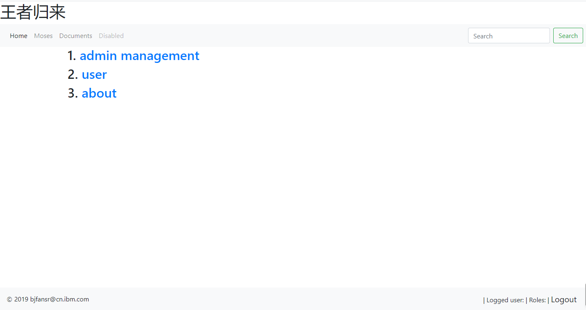
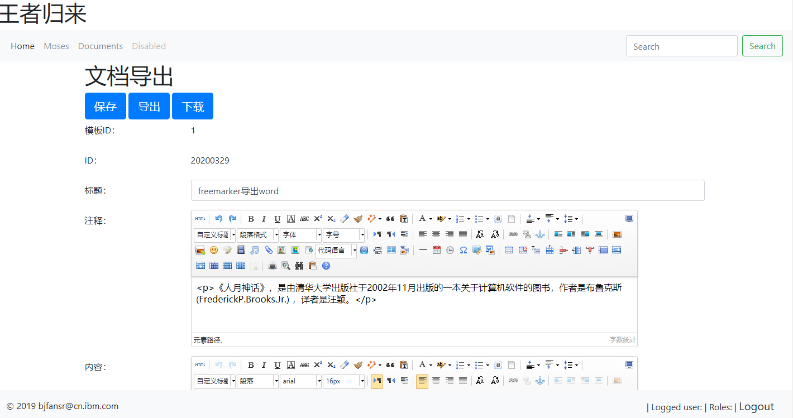

# moses-boot

> A springboot2.2 project based on thymeleaf 、 mybatis plus.

#### Features

* springboot2.2.
* thymeleaf.
* mybatis plus.
* 简单权限认证spring-security5.1.
* 富文本ueditor.
* 邮件发送.
* 异步.
#### Screenshots ( The actual UI will be slightly different because I am lazy to keep up to date :p )





## Build Setup

``` bash

# Clone project
git clone https://github.com/glory2018/moses-boot.git

## You will see the following output. 
##[1]
##[1] > Tomcat started on port(s): 8080 (http) with context path ''

# Visit the http://localhost:8080

```
#由于Oracle授权问题，Maven3不提供oracle JDBC driver
mvn install:install-file -Dfile=D:\program\lib\ojdbc6.jar -DgroupId=com.oracle -DartifactId=ojdbc6 -Dversion=11.2.0.1.0 -Dpackaging=jar

<!-- 添加oracle驱动依赖 -->
<dependency>
<groupId>com.oracle</groupId>
<artifactId>ojdbc6</artifactId>
<version>11.2.0.1.0</version>
</dependency>
